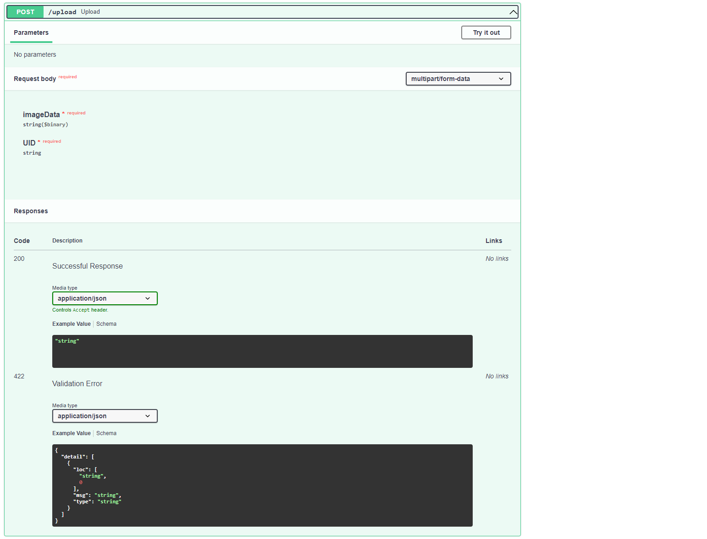
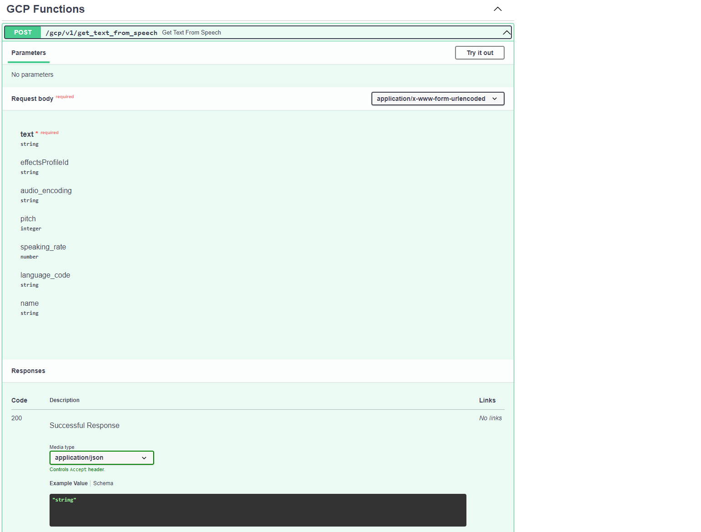
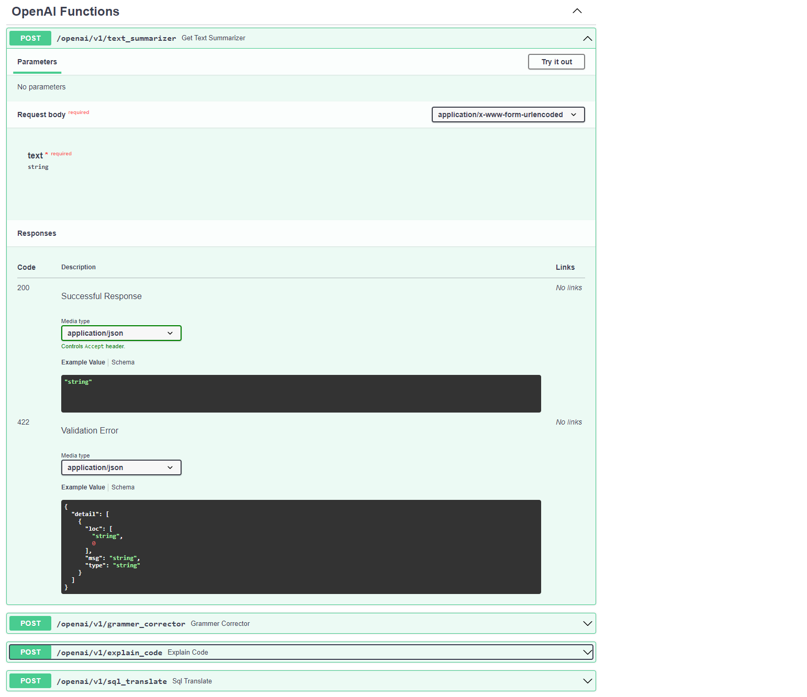
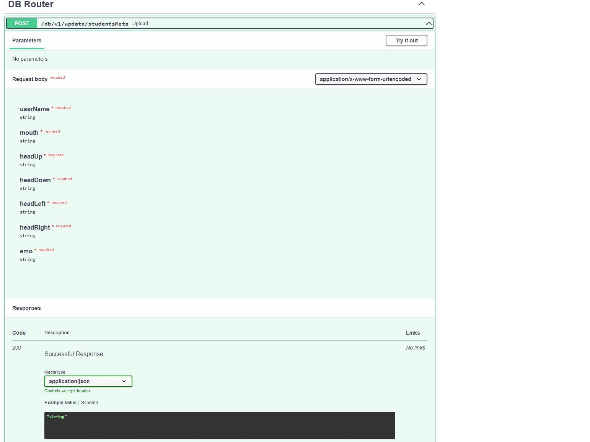

# Google-Cloud-Next-Big-Thing
This repo is created for project submitted in Google Cloud Next Big Thing Hackathon.

## Vidya  
Making Education Accessible, Smarter & Stress free. Vidya is complete student mnagement platform that focuses on providing best in class platform
with added intelligence that continuously monitors mental health issues among students at an early stage using AI by monitoring parameters like      attentiveness, emotional state, academic performance during classes so that they can receive appropriate care on time.
    
## Features:

- AI based online classroom system
- Multiple AI based solutions to help students with different tasks like understanding existing codes, summary extractor to get easy understanding of lessons etc.
- AI powered chatbot to help students find resources esily.
- Combining different models of summary extractor, text to speech and deep fake to help teacher create explanation videos for different chapters by just uploading text files of chapters.
- Detecting emotion levels and connecting counsellors
- Pose estimnation and eye tracking models for calculating the attentiveness during the class.

## Routes
Api backend is hosted on compute instance on GCP. ANd contains following routes:
- Frame Upload(To send frames from webcam to ML models for inference)

- GCP functions(Different GCP API like spech-to-text)

- Open AI(Ml models like text extractor, grammer correction, code understanding etc.)

- DB router(DB access)

## Instructions to run application:

  1. Create a python 3.8 virtual environment and proceeed with installation there:
  
  2. Clone this repository cd to folder and install the modules in requirements.txt and run
       pip install -r requirements.txt.

  3. To run this project, Open command prompt type 

  4. Type python manage.py migrate and then python manage.py runserver
  
  5. You Can See The Website Live in  http://127.0.0.1:8000/
  
  6. Create a new account at the sign up page and avail the services.

## Motivation for the project:

The past 2 years of the pandemic have had a very significant impact on our lives both in terms of our physical and mental well-being. Research states that the depression rates in students between ages 10-18 have increased by 72% since the pandemic has started. Therefore to fix this issue, we have created an AI-based online classroom system that monitors various parameters like facial expressions, voice, attentiveness of a student during the class and generates a meta score that gives an overall idea about the mental well-being of the student. Based on this score, the school counselors will be notified and then the student can have a one on one therapy session with the counselor. This system can help identify signs of depression at early stages which makes it significantly easy to help the student in a safe environment. 

## Tech stack and Modules used:

        React , Flask , Python , NLP ,TensorFlow , OpenCV , Assembly ai
        
        
## AI based monitoring processes:

  Using an artificial intelligence model. The proposed scheme tracks emotions such as happy,sad,tensed,scared 
  and head,eye,mouth movements, which can be converted into a meta-score based on predefined threshold values 
  selected by the authority who conducts the assessment. The thresholds for the two parameters can be adjusted independently, avoiding false results.

## Assembly ai

  Using Assembly ai Sentiment Analysis, can detect the sentiment of each sentence of speech spoken in your audio files.
  Sentiment Analysis returns a result of POSITIVE, NEGATIVE, or NEUTRAL for each sentence in the transcript.We also 
  incorporate these results to our meta-score.
  
## Overview of Website:

